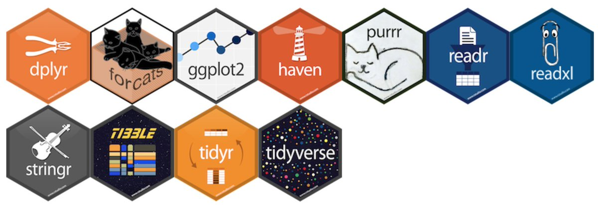

```{r setup, include = FALSE, cache = FALSE}
source(paste0(params$setup_path, "knitr_setup.R"))
```

## References

Many ideas/examples inspired/stolen there:

### R for data science [@r4ds], [http://r4ds.had.co.nz](http://r4ds.had.co.nz)

{width="50px"}\


### Tidyverse website, [https://www.tidyverse.org/](https://www.tidyverse.org/)

{width="50%"}\


## Prerequisites

### Data Structures in base R
  1. Atomic vector (integer, double, logical, character)
  2. Recursive vector (list)
  3. Factor
  4. Matrix and array
  5. Data Frame

### R base programming
  1. Control Statements
  2. Functions
  3. Functionals
  4. Input/output
  5. Rstudio API (application programming interface)

# Introduction to tidy data and tidyverse

```{r tidy_data, child = paste0('tidyverse/', c("tidy_data.Rmd", "tidyverse.Rmd")), cache = FALSE}
```

# magrittr

# tidyr

# dplyr

# tibble

## References

