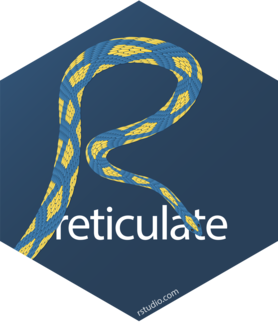

```{r setup, include = FALSE, cahe = FALSE}
source(paste0(params$setup_path, "knitr_setup.R"))
```

# What is R?

```{r whatisR, child = paste0('introR/', c("whatisR.Rmd", "whyR.Rmd")), cache = FALSE}
```

# Getting started

```{r whatisR, child = paste0('introR/', c("install.Rmd", "Rsession.Rmd", "resources.Rmd")), cache = FALSE}
```


# R markdown
```{r rmarkdown, child = paste0('rmarkdown/', c("rmarkdown.Rmd")), cache = FALSE}
```

# Interfacing with other languages

## Rcpp 

### Seamless R and C++ integration with Rcpp [@Rcpp], for sale but see [http://dirk.eddelbuettel.com](http://dirk.eddelbuettel.com)

{width="50px"}\

```{r Rcpp, child = paste0('Rcpp/', c("RcppArmadillo.Rmd")), cache = FALSE}
```

## Reticulate

###  R interface to Python [https://rstudio.github.io/reticulate/](https://rstudio.github.io/reticulate/)

{width="50px"}\

```{r rmarkdown, child = paste0('reticulate/', c("reticulate.Rmd")), cache = FALSE}
```

# First steps

## Basic notions

\C{R} owns the same ingredients as most programming language

### Functions 

Functions have a special flavor in \C{R} (functional programming)

### Variables, Objects

We manipulate object in \C{R} (as in OO programming)

### Data structure

  1. Atomic vector (integer, double, logical, character)
  2. List (recursive vector)
  3. Factor (vector with categories of values)
  4. Matrix and array
  5. Data Frame

### Resources
  - Advanced R, chapters I.2, I.3 [@advr, [http://adv-r.had.co.nz/](http://adv-r.had.co.nz/)]
  - [https://rbasics.netlify.app/](https://rbasics.netlify.app/)

## Your turn

I do not believe (anymore) in learning any programming language by reading slides

### Basics programming

```{r tuto basics, eval = FALSE}
learnr::run_tutorial("basics_prog" , package = "MAP573tutorials")
```

### Basics plotting

```{r tuto basics vis, eval = FALSE}
learnr::run_tutorial("basics_vis" , package = "MAP573tutorials")
```

### Swirl

```{r, eval = FALSE}
library(swirl)
install_course_github("swirldev", "R_Programming_E")
swirl()
```

## Going further

_Great_ material available on the web

### Advanced R [@advr], [http://adv-r.had.co.nz/](http://adv-r.had.co.nz/)

{width="50px"}\

### Modern dive into R [@moderndive], [https://moderndive.com/](https://moderndive.com/)

{width="50px"}\

### Other personal links

- Base R: more comprehensive, faster [https://github.com/jchiquet/CourseAdvancedR/](https://github.com/jchiquet/CourseAdvancedR/)
- Keep watch: workgroup [https://stateofther.github.io/](https://stateofther.github.io/)

## Bibliographical references {.allowframebreaks}

