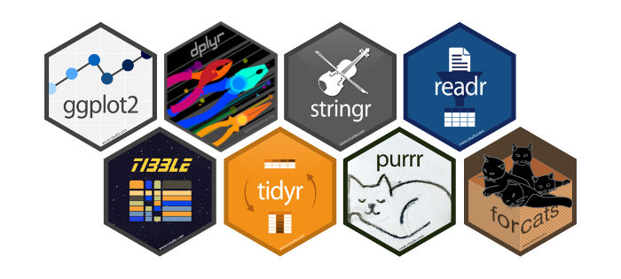

```{r setup, include = FALSE, cache = FALSE}
source(paste0(params$setup_path, "knitr_setup.R"))
```

## References

Many ideas/examples inspired/stolen there:

### R for data science [@r4ds], [http://r4ds.had.co.nz](http://r4ds.had.co.nz)

{width="50px"}\


### Tidyverse website, [https://www.tidyverse.org/](https://www.tidyverse.org/)

Core packages

{width="50%"}\


## Prerequisites

### Data Structures in base R
  1. Atomic vector (integer, double, logical, character)
  2. Recursive vector (list)
  3. Factor
  4. Matrix and array
  5. Data Frame

### R base programming
  1. Control Statements (`if/then/else`, `while`, `for`)
  2. Functions 
  3. Functionals (`[x]apply`)
  4. Input/output (`read.[x]/write.[x]`)
  5. Rstudio IDE

# Introduction

```{r, child = paste0('tidyverse/', c("tidy_data.Rmd", "tidyverse.Rmd")), cache = FALSE}
```

# Structures and types: `tibble`, `forcats`, `stringr`

```{r, child = paste0('tidyverse/', c("tibble.Rmd", "forcats.Rmd", "stringr.Rmd", "lubridate.Rmd")), cache = FALSE}
```

# data wrangling: `readr`, `tidyr`, `dplyr`

```{r, child = paste0('tidyverse/', c("readr.Rmd", "tidyr.Rmd", "dplyr.Rmd", "dplyr_exercises.Rmd")), cache = FALSE}
```

# Manipulation: `magrittr`, `purrr`

```{r, child = c("tidyverse/magrittr.Rmd", "functionals/intro_functionals.Rmd", "tidyverse/purrr.Rmd"), cache = FALSE}
```

# Visualization: `ggplot2`

```{r, child = paste0('tidyverse/', c("ggplot2.Rmd")), cache = FALSE}
```

## References

